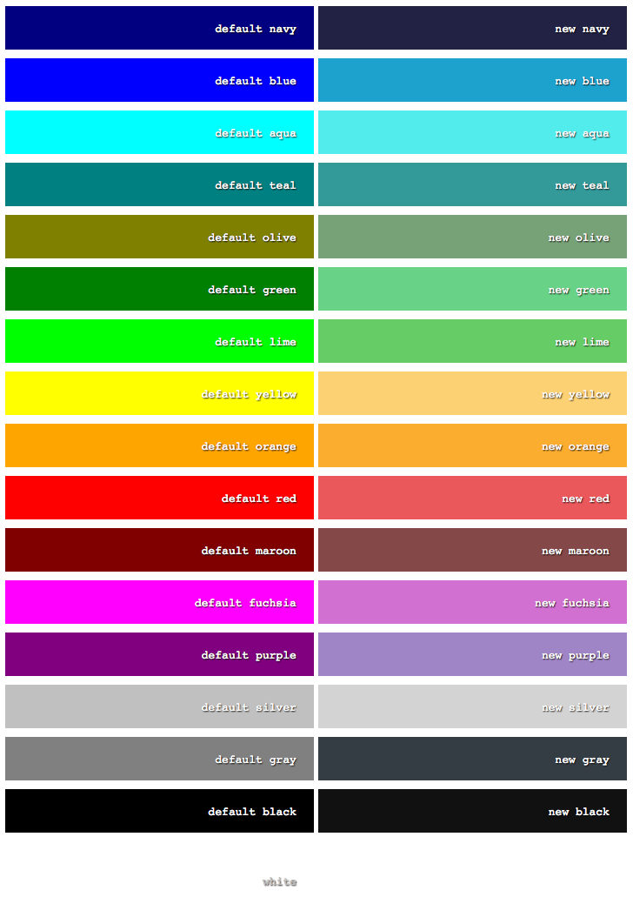

clrs
====

Better default color palette for CSS.

Palette
-------



Usage
-----

Usage is pretty straightfoward: load it into you project and use it like usual default colors.

```stylus

.navy li:first-child
  background-color navy

.blue li:first-child
  background-color blue

.aqua li:first-child
  background-color aqua

.teal li:first-child
  background-color teal

.olive li:first-child
  background-color olive

.green li:first-child
  background-color green

.lime li:first-child
  background-color lime

.yellow li:first-child
  background-color yellow

.orange li:first-child
  background-color orange

.red li:first-child
  background-color red

.maroon li:first-child
  background-color maroon

.fuchsia li:first-child
  background-color fuchsia

.purple li:first-child
  background-color purple

.silver li:first-child
  background-color silver

.gray li:first-child
  background-color gray

.black li:first-child
  background-color black

.white li:first-child
  background-color white

```
Roadmap
------

- [x] Add LESS version
- [x] Add SASS version
- [x] Add prefix to Stylus vars
- [ ] Improve README

License
-------

MIT
